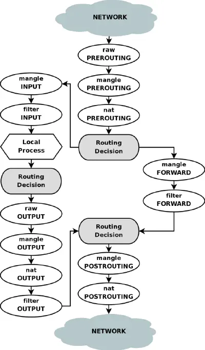

[Docs](https://www.netfilter.org/documentation/HOWTO/NAT-HOWTO.html)


## All about tables and chains and netfilter hooks

[best reference for iptables and its relation to linux kernel (netflix hooks)](https://www.digitalocean.com/community/tutorials/a-deep-dive-into-iptables-and-netfilter-architecture)

## Traversing of tables and chains

[Ref1](https://rlworkman.net/howtos/iptables/chunkyhtml/c962.html)

## Iptables in debian

[Ref2](https://wiki.debian.org/iptables)

## practical flgas

```bash
# List the rules in a chain or all chains (-n: numeric addresses)
iptables -L -n

# Print the rules in a chain or all chains
iptables -S -n

# table to manipulate (default: `filter')
iptables -t mangle

# add as the very first rule
iptables -I chain_name 1

# show the rules by their number
iptables -t nat -L --line-numbers

# delete rule by its number (`iptables -D [CHAIN] [LINE_NUMBER]`)
iptables -t nat -D POSTROUTING 4

# you can also delete by specefing the rule
iptables -D [CHAIN] [RULE_SPECIFICATION]
```

## docker config

[Route over specefic host interface](https://maxammann.org/posts/2020/04/routing-docker-container-over-vpn/)

```bash
# block outgoing TCP traffic to destination port 80 for the country with the country code "IR" (Iran)
sudo iptables -A OUTPUT -m geoip -p tcp --destination-port 80 --dst-cc IR -j DROP

# remove all the rules from the firewall and set the default policy for all chains to ACCEPT
sudo iptables -F

# let the traffic through the docker interface reach the public ip on port 8015 (runner passed, job not passed)
sudo iptables -A INPUT -p tcp -i docker0 -d {ip_address} --dport 8015 -j ACCEPT

# (both passed)
sudo iptables -A INPUT -p tcp -d {ip_address} --dport 8015 -j ACCEPT
```

## logging in iptables

[Ref1](https://www.ibm.com/docs/hr/dsm?topic=iptables-configuring)

## iptables help

```bash
iptables v1.8.7

Usage: iptables -[ACD] chain rule-specification [options]
        iptables -I chain [rulenum] rule-specification [options]
        iptables -R chain rulenum rule-specification [options]
        iptables -D chain rulenum [options]
        iptables -[LS] [chain [rulenum]] [options]
        iptables -[FZ] [chain] [options]
        iptables -[NX] chain
        iptables -E old-chain-name new-chain-name
        iptables -P chain target [options]
        iptables -h (print this help information)

Commands:
Either long or short options are allowed.
  --append  -A chain            Append to chain
  --check   -C chain            Check for the existence of a rule
  --delete  -D chain            Delete matching rule from chain
  --delete  -D chain rulenum
                                Delete rule rulenum (1 = first) from chain
  --insert  -I chain [rulenum]
                                Insert in chain as rulenum (default 1=first)
  --replace -R chain rulenum
                                Replace rule rulenum (1 = first) in chain
  --list    -L [chain [rulenum]]
                                List the rules in a chain or all chains
  --list-rules -S [chain [rulenum]]
                                Print the rules in a chain or all chains
  --flush   -F [chain]          Delete all rules in  chain or all chains
  --zero    -Z [chain [rulenum]]
                                Zero counters in chain or all chains
  --new     -N chain            Create a new user-defined chain
  --delete-chain
             -X [chain]         Delete a user-defined chain
  --policy  -P chain target
                                Change policy on chain to target
  --rename-chain
             -E old-chain new-chain
                                Change chain name, (moving any references)
Options:
    --ipv4      -4              Nothing (line is ignored by ip6tables-restore)
    --ipv6      -6              Error (line is ignored by iptables-restore)
[!] --proto     -p proto        protocol: by number or name, eg. `tcp'
[!] --source    -s address[/mask][...]
                                source specification
[!] --destination -d address[/mask][...]
                                destination specification
[!] --in-interface -i input name[+]
                                network interface name ([+] for wildcard)
 --jump -j target
                                target for rule (may load target extension)
  --goto      -g chain
                               jump to chain with no return
  --match       -m match
                                extended match (may load extension)
  --numeric     -n              numeric output of addresses and ports
[!] --out-interface -o output name[+]
                                network interface name ([+] for wildcard)
  --table       -t table        table to manipulate (default: `filter')
  --verbose     -v              verbose mode
  --wait        -w [seconds]    maximum wait to acquire xtables lock before give up
  --wait-interval -W [usecs]    wait time to try to acquire xtables lock
                                default is 1 second
  --line-numbers                print line numbers when listing
  --exact       -x              expand numbers (display exact values)
[!] --fragment  -f              match second or further fragments only
  --modprobe=<command>          try to insert modules using this command
  --set-counters PKTS BYTES     set the counter during insert/append
[!] --version   -V              print package version.
```

## make rules persistent

[Docs](https://wiki.debian.org/iptables)

### first solution

```bash
iptables-save > /etc/iptables.up.rules
cat <<EOF > /etc/network/if-pre-up.d/iptables
#!/bin/sh
/sbin/iptables-restore < /etc/iptables.up.rules
EOF
chmod +x /etc/network/if-pre-up.d/iptables
```

### second solution (iptables-persistent package)

[Ref](https://www.cyberciti.biz/faq/how-to-save-iptables-firewall-rules-permanently-on-linux/)

## DNAT and SNAT

[Examples](https://gist.github.com/tomasinouk/eec152019311b09905cd)

## route each traffic with specefic IP to the outside

[Ref1](https://www.reddit.com/r/docker/comments/qld301/binding_specific_outbound_ip_address_to_docker/)
[Ref2](https://serverfault.com/questions/762492/route-outgoing-connections-from-a-docker-container-through-a-specific-ip)
[Ref3](https://forums.docker.com/t/using-secondery-ip-for-docker/93485/3)
[Some Interesting Logs](https://serverfault.com/questions/1108123/docker-containers-with-public-ips-bridged-network)

This can be done using changing IP headers with `SNAT`:

```bash
iptables -t nat -I POSTROUTING 1 -s 172.18.0.1 -j SNAT --to-source 192.168.1.101
```

### auto script

```bash
# enter container name
echo enter container name
read container

#  enter outbound ip you want to assign the container
echo enter outbound nat ip to set
read nat_ip

# get ip of container and store as $container_ip
container_ip=$(docker inspect -f '{{range.NetworkSettings.Networks}}{{.IPAddress}}{{end}}' $container)

# add nat rule to postrouting table
sudo iptables -t nat -I POSTROUTING -p all -s $container_ip/32 -j SNAT --to-source $nat_ip

# or to ignore internal network destinations
# sudo iptables -t nat -I POSTROUTING -p all -s $container_ip/32 ! -d 172.16.0.0/12 -j SNAT --to-source $nat_ip

# verify rule has been added
sudo iptables -t nat -v -L POSTROUTING -n --line-number | grep $container_ip
```
