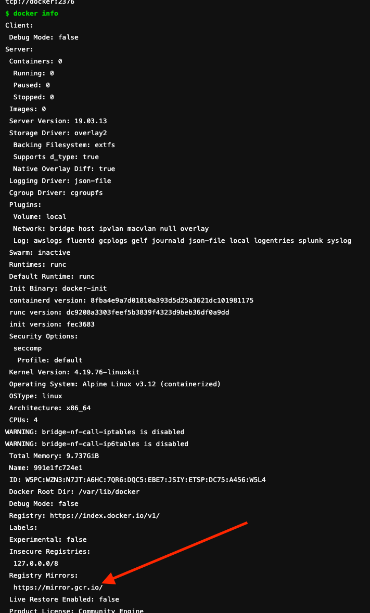

## set registry mirror for dind docker host

[Docs](https://docs.gitlab.com/ee/ci/docker/using_docker_build.html#enable-registry-mirror-for-dockerdind-service)

[Configure local mirror](https://github.com/docker-library/docker/issues/38#issuecomment-529049778)

[With small examples](https://gitlab.com/gitlab-org/gitlab-runner/-/issues/27171)

[Acknowledge with docker info](https://gitlab.com/-/project/250833/uploads/95092f181f5b395cd9212ccfde317ae9/Screen_Shot_2020-10-27_at_14.19.43.png)



## troubleshooting

When you customize docker dind service and not set `alias` for that to be resolvable by docker client

[dial tcp: lookup `docker` on 8.8.8.8:53: no such host](https://stackoverflow.com/questions/64902228/gitlab-ci-cd-docker-in-docker-failing-with-custom-dind-service)

```yaml
  services:
    - name: private_registry/docker:20.10.16-dind
      alias: docker # to be able to get accessed by the job container
```
