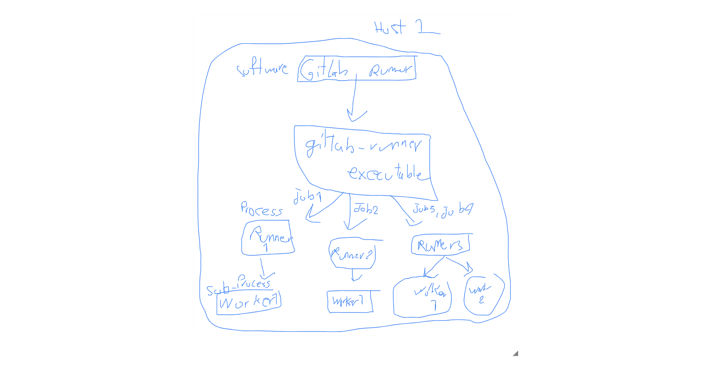

## install Gitlab Runner software

[Docs](https://docs.gitlab.com/runner/install/docker.html)

## register runner (after 16.0)

[Docs](https://docs.gitlab.com/runner/register/index.html)

[Runner Types Docs](https://docs.gitlab.com/ee/ci/runners/runners_scope.html)

```bash
docker run --rm -it -v /srv/gitlab-runner/config:/etc/gitlab-runner gitlab/gitlab-runner register  --url https://example.com  --token glrt-XXXXXXXXXXXXXX
```

```bash
docker run --rm -v /srv/gitlab-runner/config:/etc/gitlab-runner gitlab/gitlab-runner register \
  --non-interactive \
  --url "https://gitlab.com/" \
  --token "$RUNNER_TOKEN" \
  --executor "docker" \
  --docker-image alpine:latest \
  --description "docker-runner"
```

### non-interactive example

```bash
gitlab-runner register \
    --non-interactive \
    --executor "shell" \
    --url "https://gitlab.com/" \
    --token "REDACTED"
```

## Other than Docker-in-Docker (dind) solution (WARNING: Exposes the Docker engine of the host!)

```bash
docker run --rm -it -v /srv/gitlab-runner/config:/etc/gitlab-runner gitlab/gitlab-runner register --docker-image "docker:20.10.16" --docker-volumes /var/run/docker.sock:/var/run/docker.sock
```

## config

[main ref](https://docs.gitlab.com/runner/configuration/advanced-configuration.html)

[auto-scale](https://docs.gitlab.com/runner/configuration/autoscale.html)

[ref](https://docs.gitlab.com/ee/ci/runners/configure_runners.html)

## docker image tags

[Docker Hub Link](https://hub.docker.com/r/gitlab/gitlab-runner/tags)

## configure registry

### Standard authentication methods

```bash
[[runners]]
  environment = ["DOCKER_AUTH_CONFIG={\"auths\":{\"registry.example.com:5000\":{\"auth\":\"bXlfdXNlcm5hbWU6bXlfcGFzc3dvcmQ=\"}}}"]

```

### Docker-in-Docker Mode

When you use Docker-in-Docker, the standard authentication methods do not work, because a fresh Docker daemon is started with the service.

```bash
cp ~/.docker/config.json /opt/.docker/

[[runners]]
  ...
  executor = "docker"
  [runners.docker]
    ...
    privileged = true
    volumes = ["/opt/.docker/config.json:/root/.docker/config.json:ro"]
```

## configure docker mirror for dind service

[Docs](https://docs.gitlab.com/ee/ci/docker/using_docker_build.html#enable-registry-mirror-for-dockerdind-service)

[Origin Issue](https://gitlab.com/gitlab-org/gitlab-runner/-/issues/27171)

## Monitoring runners

[Docs](https://docs.gitlab.com/runner/fleet_scaling/#monitoring-runners)

[Dashboards](https://gitlab.com/gitlab-com/runbooks/-/tree/master/dashboards/ci-runners)

## really good description about runner and worker concepts

[ref](https://stackoverflow.com/questions/54534387/how-gitlab-runner-concurrency-works)

## install GitLab Runner Manager in a container

```bash
docker run -d --name gitlab-runner --restart always \
  -v /srv/gitlab-runner/config:/etc/gitlab-runner \
  -v /var/run/docker.sock:/var/run/docker.sock \
  gitlab/gitlab-runner:latest

```

## Gitlab Runner, runner, worker

[Docs](https://docs.gitlab.com/runner/fleet_scaling/)
