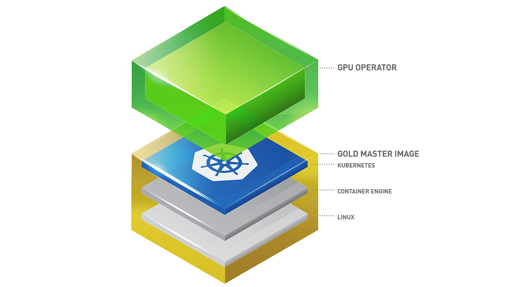

Kubernetes provides access to special hardware resources such as NVIDIA GPUs, NICs, Infiniband adapters and other devices through the device plugin framework. However, configuring and managing nodes with these hardware resources requires configuration of multiple software components such as drivers, container runtimes or other libraries which are difficult and prone to errors. The NVIDIA GPU Operator uses the operator framework within Kubernetes to automate the management of all NVIDIA software components needed to provision GPU. These components include the NVIDIA drivers (to enable CUDA), Kubernetes device plugin for GPUs, the NVIDIA Container Toolkit, automatic node labelling using GFD, DCGM based monitoring and others.

[Install](https://docs.nvidia.com/datacenter/cloud-native/gpu-operator/latest/getting-started.html)

## install in MicroK8s

[Install on MicroK8s](https://microk8s.io/docs/addon-gpu)
[Infer Repo](https://github.com/reconfigurable-ml-pipeline/infrastructure/blob/master/manual-installation/gpu.md)

```bash
microk8s enable gpu

# verify installation (expected: 'all validations are successful')
kubectl logs -n gpu-operator-resources -lapp=nvidia-operator-validator -c nvidia-operator-validator

# see all resources in the namespace
kubectl get all -n gpu-operator-resources

# check the capability has been added (expected: 'nvidia.com/gpu: 1' in Capability)
kubectl describe node arman-gpu
```

[GitHub](https://github.com/NVIDIA/gpu-operator)

[Other Docs](https://docs.mirantis.com/mke/3.4/ops/deploy-apps-k8s/gpu-support.html)
