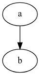

[Docs](https://graphviz.org/)

[Repo](https://gitlab.com/graphviz/graphviz)

## Graphviz

Graphviz is open-source graph visualization software used to represent structural information as diagrams of abstract graphs and networks. It is valuable in various fields like networking, bioinformatics, software engineering, database and web design, machine learning, and other technical domains. Graphviz provides layout programs that create diagrams from graph descriptions in a simple text language, generating formats like images, SVG, PDF, and Postscript. It offers features for customizing diagrams with colors, fonts, layouts, and shapes, making it a versatile tool for visualizing complex data structures and relationships.

## DOT language

The DOT language is a graph description language developed as part of the Graphviz project. It is used to define graphs, nodes, edges, subgraphs, and clusters. DOT graphs are typically stored as files with the .gv or .dot filename extension. The language allows users to describe both undirected and directed graphs, with various layout programs available to render and manipulate the graphs. Some of the layout programs include dot, neato, twopi, circo, fdp, and sfdp, each serving different graph visualization needs. DOT is not only a language for defining graphs but also provides facilities for rendering and viewing graphs in different formats like SVG, PDF, PNG, and more. It is widely used in various applications like software engineering, network design, bioinformatics, and machine learning for visualizing complex data structures and relationships.

## exmaple

```bash
echo 'digraph { a -> b }' | dot -Tsvg > output.svg
```


