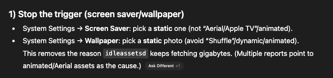
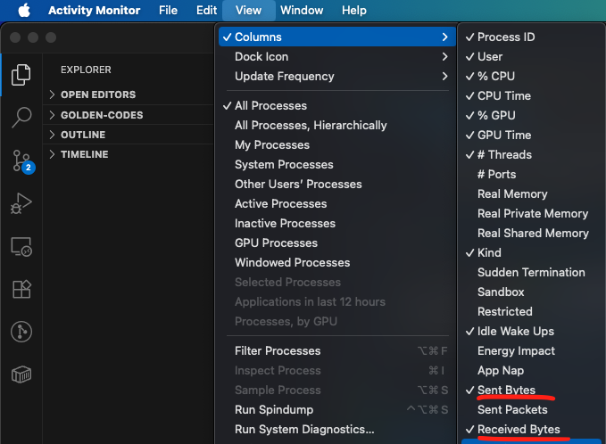
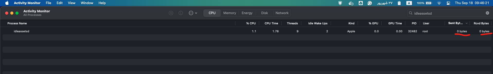

## idleassetsd

* **`idleassetsd`**: This is a macOS system process introduced in recent macOS versions. It handles *"idle assets"* — large downloads that the system schedules when your Mac is idle or on Wi-Fi + power. This can include:

    * macOS updates / pre-downloads of future upgrades
    * Xcode / developer tool caches (if you have developer tools installed)
    * ML/AI model downloads (for features like Visual Look Up, transcription, Siri, Apple Intelligence, etc.)
    * Caching large assets from Apple servers (notice the `sylvan.apple.com` and `configuration.apple.com` domains in your screenshot — these are Apple’s content delivery and config servers).

That **84.3 GB in 3 hours** is huge. It likely means your Mac pulled down:

* A full macOS upgrade image (Sequoia installer is \~14–16 GB, but sometimes it keeps multiple versions or re-downloads if interrupted), **plus**
* Machine learning “foundation model” files (these can be **tens of GB** in Sequoia because of Apple Intelligence features).

---

### Monitor it

#### Using nettop

```bash
sudo nettop -p idleassetsd -J bytes_in,bytes_out
```

#### Using Activity Monitor app

You should enable `All Processes` from the `View` menu bar first:



Then you can also enable the Recvd and Sent Bytes in:



And then if you search `idleassetsd`, you can see the result:



### Stop it FAST and WILDLY

Add this to the `/etc/hosts`:

```bash
# workaround for idleassets bandwidth consumption
127.0.0.1             sylvan.apple.com
```

### How to prevent huge background downloads

Unfortunately, Apple doesn’t give a simple toggle for `idleassetsd`, but you can limit its impact:

1. **Set a static image for `Wallpapers` and `Screensavers`:**

   > I contacted Apple Support and they recommended setting Wallpapers and Screensavers to a static image.
   > After restarting Activity Monitor `idleassetsd` stopped downloading as it is now at 0 bytes sent and recieved.

2. **Block large background traffic:**

   * You can use **Little Snitch** or **LuLu** (firewall apps) to monitor and block `idleassetsd` from accessing Apple servers if you want strict control. The program path to block is `/System/Library/PrivateFrameworks/TVIdleServices.framework/idleassetsd`

3. **Turn off automatic macOS updates:**

   * Go to **System Settings → General → Software Update → Automatic Updates**.
   * Disable **“Download new updates when available”** and **“Install system files and security responses”** if you want full control.

4. **Restrict background ML downloads (Apple Intelligence / ML models):**

   * Go to **System Settings → General → Siri & Spotlight**.
   * Disable features like **Suggestions**, **Siri learning**, or **Apple Intelligence** (if available in your region).
   * This prevents some of the huge model downloads.

5. **Limit caching servers (for advanced users):**

   * macOS sometimes acts like a “caching server” for iOS/macOS updates. Check in **System Settings → General → Sharing → Content Caching** and disable it if on.

6. **Clear already-downloaded data (optional):**

   * Look in `/Library/Application Support/com.apple.idleassetsd` or `/System/Library/Assets` (read-only without disabling SIP).
   * Usually safe to leave them, but if space is critical, you can clean caches.

---

✅ **Recommendation**: Disable auto updates + caching if you don’t want this again. If it happens *constantly* (like every few hours), it may be a bug or corrupted asset download loop — in that case, I’d suggest a reboot + `safe mode` boot, or contacting Apple Support.

---

## advanced solutions

```bash
/Library/Application Support/com.apple.idleassetsd/Customer/4KSDR240FPS
```

And all the files are large `.mov` files (hundreds of MB to almost 1 GB each).

👉 That directory name (`4KSDR240FPS`) indicates **video assets** — specifically **sample video clips** that macOS downloads in the background.
These are the same videos used in:

* **Apple TV screensavers** (the “Aerial” views like Earth, underwater, space, etc.), but in this case, the **4K 240FPS** variants that are *extremely large*.
* Some are also used by **machine learning / video analysis training** features in macOS Sequoia.

So your system has been silently pulling down **Apple’s 4K HDR / 240FPS demo/screen saver videos** via `idleassetsd`. That explains why you saw **84GB of downloads in a few hours** — each clip is hundreds of MB and there are many of them.

---

### How to investigate further (Terminal commands)

You can confirm and explore more with these:

1. **Check what `idleassetsd` is doing in real time:**

   ```bash
   sudo lsof -c idleassetsd
   ```

   This shows what files/sockets the process has open (e.g., active downloads).

2. **Check its log messages:**

   ```bash
   log show --predicate 'process == "idleassetsd"' --last 1h
   ```

   Replace `1h` with `6h` or `1d` to look back further. You’ll see exactly what assets it decided to fetch.

3. **Inspect downloaded assets with metadata:**

   ```bash
   mdls /Library/Application\ Support/com.apple.idleassetsd/Customer/4KSDR240FPS/*.mov | grep -E "kMDItemWhereFroms|kMDItemContentType|kMDItemPixelHeight|kMDItemPixelWidth|kMDItemDurationSeconds|kMDItemFSSize"
   ```

   This will tell you where macOS thinks the file came from, resolution, and duration:

   * **kMDItemWhereFroms**: Displays the URL from where it was downloaded (likely Apple’s content servers).
   * **kMDItemContentType**: Shows file type (it should say `public.movie`).
   * **kMDItemPixelHeight** / **kMDItemPixelWidth**: Resolution (4K = 3840 x 2160).
   * **kMDItemDurationSeconds**: Duration of the video in seconds.
   * **kMDItemFSSize**: Size of each file.

4. **See how much total space is used:**

   ```bash
   du -sh /Library/Application\ Support/com.apple.idleassetsd
   ```

5. **If you want to delete them:**

   ```bash
   sudo rm -rf /Library/Application\ Support/com.apple.idleassetsd/Customer/4KSDR240FPS
   ```

   (Safe to remove; macOS may re-download them later unless blocked.)

---

### How to stop these huge video downloads

* Disable **Aerial screensavers** in **System Settings → Screen Saver** (switch to a static one).
* If you *never* want these assets:

    * Run:

    ```bash
    defaults write com.apple.idleassetsd disable -bool true
    ```

    Then reboot.
    (This is undocumented, but works as a kill-switch on some macOS builds.)
* Alternatively, block the domains (`sylvan.apple.com`) via firewall (Little Snitch/LuLu).

---

✅ So in short: those **84 GB are Apple’s 4K HDR screensaver videos**, silently fetched by `idleassetsd`.

---

Your snippet shows **`idleassetsd`** using **TVIdleServices.Aerial** to fetch from `sylvan.apple.com/itunes-assets/Aerials…` and then:

> `downloadableAssetCountToReachMinimum… needs 3 more asset(s)`
> `Starting batch download of 16 assets`

Those are the **Apple “Aerial” screen saver videos** (the 4K SDR **240 fps** variants). The folder name you listed earlier (`…/Customer/4KSDR240FPS`) and the `.mov` files align perfectly with that.

---

## Useful Terminal checks

1.  **See which screen saver is currently selected**

    ```bash
    defaults -currentHost read com.apple.ScreenSaver moduleDict 2>/dev/null \
    || defaults -currentHost read com.apple.screensaver moduleDict
    ```

2. **Disable the screen saver entirely (prevents Aerial from ever triggering)**

    ```bash
    defaults -currentHost write com.apple.ScreenSaver idleTime -int 0 2>/dev/null \
    || defaults -currentHost write com.apple.screensaver idleTime -int 0
    ```

    (You can re‑enable later via System Settings → Screen Saver, or by writing a non‑zero idleTime.)

3. **Confirm/monitor network & file activity**

    ```bash
    # Live network I/O for the process
    sudo nettop -p idleassetsd -J bytes_in,bytes_out

    # Live file writes/reads by the process
    sudo fs_usage -w -f filesystem idleassetsd
    ```

4. **What it has downloaded + totals**

    ```bash
    # Total on-disk size of all customer assets
    sudo du -sh "/Library/Application Support/com.apple.idleassetsd/Customer"

    # Total size of only the 4K 240fps movies
    find "/Library/Application Support/com.apple.idleassetsd/Customer/4KSDR240FPS" -type f -name "*.mov" -print0 \
    | xargs -0 stat -f %z \
    | awk '{s+=$1} END{printf "Total MOV bytes: %d (%.2f GB)\n", s, s/1024/1024/1024}'
    ```

5. **Show per‑file metadata (source URL/resolution/duration/size)**

    ```bash
    mdls "/Library/Application Support/com.apple.idleassetsd/Customer/4KSDR240FPS/"*.mov \
    | grep -E "kMDItemWhereFroms|kMDItemContentType|kMDItemPixel(Width|Height)|kMDItemDurationSeconds|kMDItemFSSize"
    ```

6. **See what the daemon is doing (last 2 hours)**

```bash
log show --predicate 'process == "idleassetsd"' --last 2h
```

---

## Stop it from downloading again

1. **Option A (recommended): switch off Aerial**

   * System Settings → **Screen Saver** → choose **anything but Aerial** (or set “Never”).
   * Then remove the cached videos:

   ```bash
   sudo rm -rf "/Library/Application Support/com.apple.idleassetsd/Customer/4KSDR240FPS"
   ```

   Optionally restart the agent so it resets its state:

   ```bash
   sudo launchctl kickstart -k system/com.apple.idleassetsd
   ```

2. **Option B: keep a screen saver, but ensure it’s local**

   * Pick a local, non‑Aerial saver (e.g., Photos with a local album).
   * Remove the 4K cache as above.

3. **Option C: firewall it (strict control)**

* Use a per‑app firewall (Little Snitch/LuLu) to deny `idleassetsd` outbound connections to `sylvan.apple.com` and `itunes-assets.apple.com`.
  (Built‑in macOS firewall doesn’t block outbound traffic.)

> Note: `launchctl disable`/`bootout` for Apple system daemons is generally blocked by SIP and can break other features. I don’t recommend permanently disabling `idleassetsd`.

---

### Why it grabbed so much

Aerial maintains a **minimum local cache** per category; your logs show it actively trying to reach that minimum and queuing **16 assets** in a batch. At \~300–1000 MB each, that easily explains the \~84 GB spike.

If you want, run the metadata command above — you’ll see `kMDItemWhereFroms` pointing at those `Aerials…` URLs and 3840×2160 (4K) dimensions with long durations, confirming they’re just screen saver videos.
